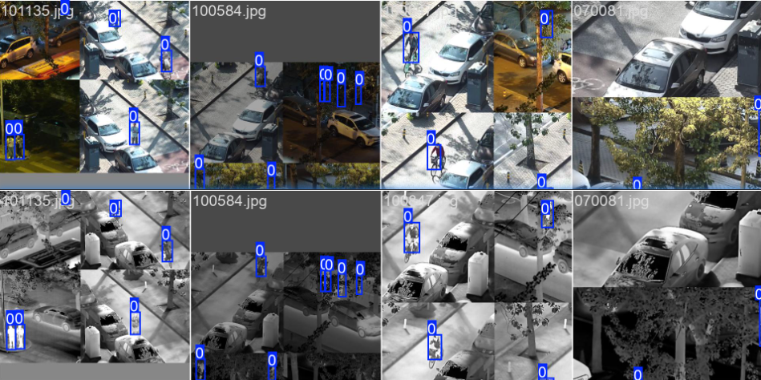

<p align="center"><a href="README.md">中文</a></p>

<p align="center">
  <a href="https://github.com/ZhangJunJieXJTU/Dual-Stream-Perception-VLM-Semantic-Correction-UAV">
    
  </a>
  <a href="LICENSE">
    
  </a>
  <a href="https://github.com/ZhangJunJieXJTU/Dual-Stream-Perception-VLM-Semantic-Correction-UAV">
    
  </a>
</p>

# Dual-Stream Perception and VLM Semantic Correction for UAV Object Detection

This repository supports the paper project **Dual-Stream Perception and VLM Semantic Correction for Generalized UAV Object Detection**. It focuses on RGB-infrared multimodal object detection for UAV scenes, especially under low light, occlusion, low contrast, small-object, and long-tail abnormal target conditions.

The current codebase provides a dual-stream RGB/IR detection baseline with training, validation, and inference scripts. It can be further extended with ByteTrack temporal association, attention heatmap filtering, VLM-based hard-case semantic correction, and trajectory smoothing.

<p align="center">
  
</p>

## Project Scope

- **Research topic**: UAV multimodal perception, RGB-infrared fusion, generalized object detection, and VLM semantic correction.
- **Detection framework**: YOLO-style training, validation, and inference workflow.
- **Dual-modal input**: Automatic pairing of RGB and infrared images by filename.
- **Fusion strategies**: Data-level fusion, decision-level fusion, early feature fusion, mid-level feature fusion, easy fusion, and DEYOLO configurations.
- **Extension target**: A code foundation for the paper pipeline: perception stream, attention stream, VLM correction, and temporal smoothing.

## Repository Layout

```text
.
├── train_dual.py              # Dual-modal training entry
├── val_dual.py                # Dual-modal validation entry
├── infer_dual.py              # Dual-modal inference entry
├── ultralytics/               # Core detection framework
├── ultralytics/cfg/models/fuse/
│   ├── Data-level-Fusion.yaml
│   ├── Decision-level-Fusion.yaml
│   ├── Early-level-Feature-Fusion.yaml
│   ├── Mid-level-Feature-Fusion.yaml
│   ├── Easy-level-Feature-Fusion.yaml
│   └── DEYOLO.yaml
└── examples/
```

## Dataset Format

RGB images and infrared images are paired automatically by filename. Keep both modalities in sibling directories with identical filenames.

```text
datasets/
├── images/
│   ├── train/
│   │   └── 000001.jpg
│   └── val/
│       └── 000002.jpg
├── imagesIR/
│   ├── train/
│   │   └── 000001.jpg
│   └── val/
│       └── 000002.jpg
└── labels/
    ├── train/
    │   └── 000001.txt
    └── val/
        └── 000002.txt
```

Labels follow the standard YOLO format. In most cases, one annotation set for RGB images is sufficient, and the corresponding IR images are matched by filename.

## Installation

```bash
git clone https://github.com/ZhangJunJieXJTU/Dual-Stream-Perception-VLM-Semantic-Correction-UAV.git
cd Dual-Stream-Perception-VLM-Semantic-Correction-UAV
pip install -e .
```

Using an isolated Python or Conda environment is recommended to avoid conflicts among PyTorch, CUDA, and OpenCV versions.

## Training

```bash
python train_dual.py
```

Before training, update the dataset configuration according to your local dataset path, for example:

```text
ultralytics/cfg/datasets/LLVIP.yaml
```

Fusion model configurations are available under:

```text
ultralytics/cfg/models/fuse/
```

## Validation

```bash
python val_dual.py
```

For paper experiments, record at least the following metrics:

- Precision
- Recall
- mAP@0.5
- mAP@0.5:0.95
- Number of parameters
- FLOPs
- Single-frame inference latency

## Inference

```bash
python infer_dual.py
```

Inference requires both RGB and infrared inputs with matched filenames.

## Mapping to the Paper Pipeline

| Paper module | Current code foundation | Planned extension |
| --- | --- | --- |
| Perception stream | RGB/IR dual-modal YOLO detection | UAV-scene training and multi-scale detection settings |
| Dual-stream fusion | Multiple RGB-IR fusion configurations | Unified comparison of fusion levels |
| Temporal association | ByteTrack can be integrated | Candidate target sequences with track IDs |
| Attention stream | To be extended | Task-driven heatmap generation and ROI attention scoring |
| VLM semantic correction | To be extended | Semantic scoring and coordinate refinement for hard cases |
| Trajectory smoothing | To be extended | Sliding-window median filtering |

## Suggested Experiments

1. RGB-only, IR-only, and RGB-IR detection comparison.
2. Ablation study across different fusion strategies.
3. Tracking stability after ByteTrack integration.
4. Hard-case detection before and after VLM correction.
5. End-to-end inference latency and VLM call-ratio analysis.

## Foundation and License

This project is organized and extended for the paper based on open-source multimodal detection implementations and the Ultralytics YOLO framework. The repository follows the AGPL-3.0 license in `LICENSE`. Please comply with the relevant open-source license terms when using, modifying, or distributing this project.
